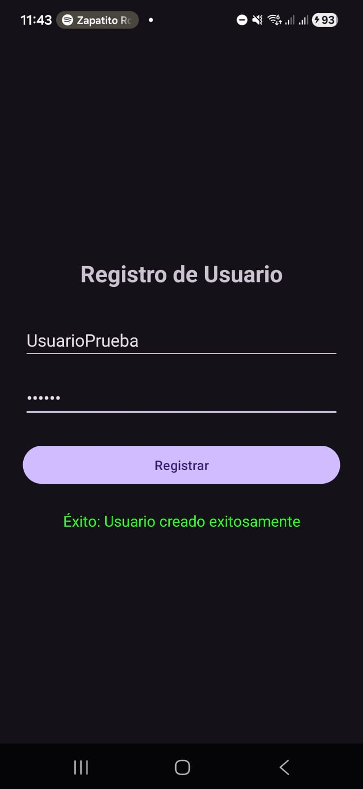
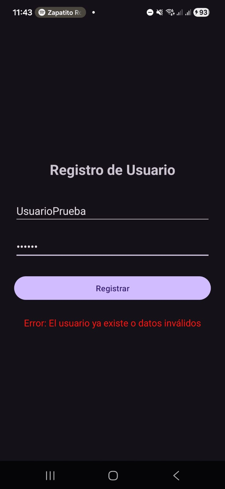
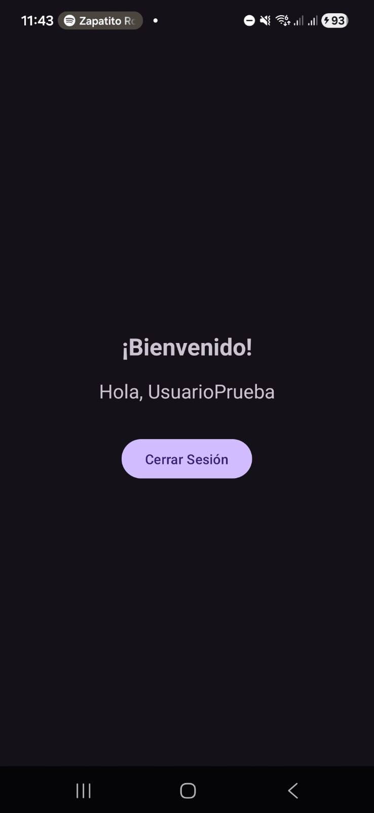
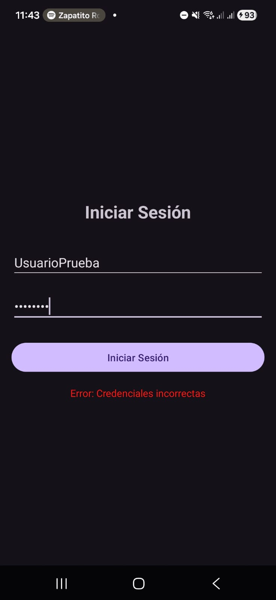
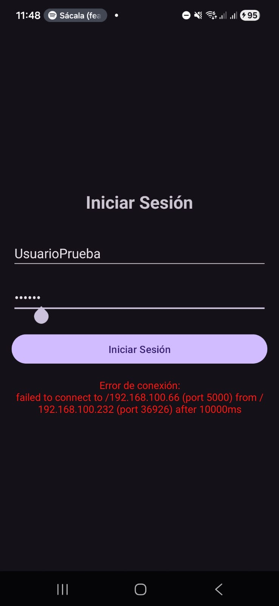

# Práctica 2: Cliente REST Android - Autenticación y Consumo de API 

Este repositorio contiene el código fuente de una aplicación Android desarrollada para demostrar el ciclo completo de comunicación HTTP (Cliente-Servidor). La aplicación consume una API REST construida con Flask y contenerizada con Docker, implementando funcionalidades de verificación de estado, registro e inicio de sesión de usuarios.

## 🛠️ Tecnologías y Librerías Utilizadas

**Frontend (Android):**
* Lenguaje: [Kotlin / Java] (API Mínima 24)
* Cliente HTTP: Retrofit 2 (con GsonConverterFactory y ScalarsConverterFactory)
* Manejo de asincronía: [Corrutinas / Callbacks estándar]
* UI: XML Layouts (ConstraintLayout, LinearLayout)

**Backend (Proporcionado):**
* Python 3.9 & Flask
* Flask-SQLAlchemy & Flask-Bcrypt (Autenticación y Hashing)
* SQLite
* Docker & Docker Compose

---

## 🚀 Requisitos Previos

Para ejecutar este proyecto de manera local, asegúrate de contar con lo siguiente:
1. **Docker Desktop** instalado y en ejecución.
2. **Android Studio** instalado.
3. Un emulador configurado (AVD) o un dispositivo físico conectado a la misma red Wi-Fi que tu computadora.

---

## ⚙️ Instrucciones para compilar y ejecutar

### Parte 1: Levantar el Backend (Local)
1. Clona el repositorio del backend proporcionado:
   `git clone [URL_DEL_REPOSITORIO_DEL_PROFESOR]`
   `cd [NOMBRE_DE_LA_CARPETA]/ORM`
2. Construye y levanta el contenedor usando Docker:
   `docker compose up --build`
3. Verifica que el servidor exponga el puerto 5000 mostrando el mensaje `* Running on all addresses (0.0.0.0)`.

### Parte 2: Configurar y Ejecutar la App Android
1. Clona este repositorio y ábrelo en Android Studio.
2. **Configuración de red (¡Importante!):**
   * Abre los archivos donde se instancia Retrofit (`MainActivity.kt`, etc.).
   * Si usas el **Emulador de Android Studio**, asegúrate de que la `BASE_URL` sea `http://10.0.2.2:5000/`.
   * Si usas un **Dispositivo Físico**, cambia la `BASE_URL` por la dirección IP local de tu computadora (ej. `http://192.168.100.66:5000/`).
3. Sincroniza el proyecto con Gradle (`Sync Project with Gradle Files`).
4. Compila y ejecuta la aplicación presionando `Shift + F10` o el botón **Run**.

---

## 📸 Entregables y Capturas de Pantalla

A continuación, se documenta el cumplimiento de los ejercicios solicitados en la práctica:

### Ejercicio 1 – Conexión y verificación de la API
Se realiza una petición GET al endpoint raíz (`/`). Se muestra la respuesta exitosa en pantalla, confirmando la conexión y los permisos de tráfico.

### Ejercicio 2 – Pantalla de Registro
La aplicación envía una petición POST a `/register` con un payload JSON. 
* **Caso Exitoso:** El usuario es registrado correctamente.
* **Caso Duplicado:** Se notifica al usuario que las credenciales ya existen.

### Ejercicio 3 – Pantalla de Login
La aplicación envía una petición POST a `/login`. Navega a la pantalla de bienvenida o muestra un mensaje de error.

### Ejercicio 4 – Manejo de errores de red
Se implementó un bloque de manejo de errores (`onFailure`). Al detener el contenedor de Docker e intentar hacer una petición, la aplicación no se cierra abruptamente, sino que muestra un mensaje amigable.

---
**Integrantes del equipo:**
* Nava Villar Eric  
* Pérez Olivares José Julio
* Perez Hernandez Tony Saifi

